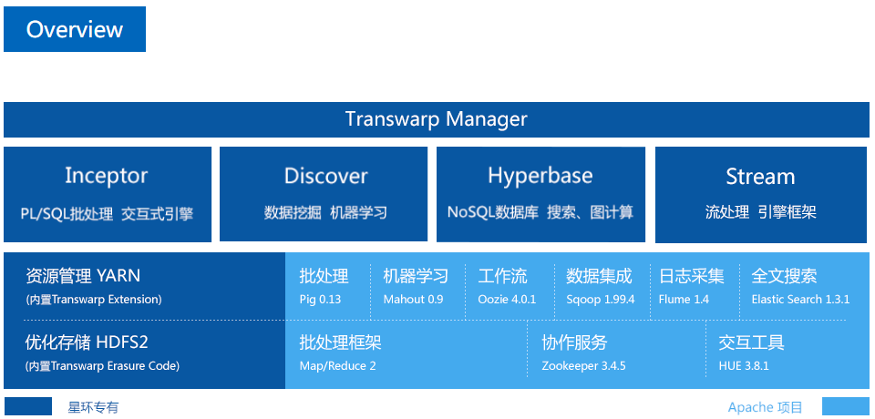

# Transwarp Sample Code

This repository contains the example projects for componetnts on [Transwarp Data Hub](http://www.transwarp.cn/product/tdh).

* Transwarp's Distribution for Apache Hadoop for Enterprise has a five-layer architecture. Different applications provide customized support via flexible combination and efficient coordination among components.

* Transwarp Inceptor in-memory analysis engine provides high-speed interactive SQL queries.

* Transwarp Hyperbase real-time data processing engine, based on Apache HBase, is optimal for highly concurrent online business systems for enterprises.

* Transwarp Stream real-time streaming processing engine, based on Apache Spark, possesses powerful stream processing abilities.

* Transwarp Discover machine learning engine provides data mining via R.

## Project List

**BatchInsert.**  Example for batch insert data by Inceptor JDBC.

**ComplexSearch.** Example for fulltext search by Inceptor JDBC (index builded by Elasticsearch).

**Elasticsearch.** Example for usage of Elasticsearch Java API.

**FlumeInterceptor.** Example for Flume's interceptor, contanins row and column (regex) filter.

**FlumeSink.** Example for Flume's sink, synchronising folders and files.

**FlumeSource.** Example for Flume's source.

**Hibernate.** Example for Inceptor work with Hibernate 3.X.

**Hibernate4.** Example for Inceptor work with Hibernate 4.X.

**Hibernate5.** Example for Inceptor work with Hibernate 5.X.

**InceptorUDAF.** Example for Inceptor UDAF.

**InceptorUDF.** Example for Inceptor UDF.

**InceptorUDTF.** Example for Inceptor UDTF.

**KafkaConsumer.** Example for Kafka consumer with multi-threading.

**KafkaDecoder.** Example for Kafka decoder.

**KafkaProducer.** Example for Kafka producer with multi-threading.

**KeywordSearch.** Example for keyword search by Inceptor JDBC (index builded by Elasticsearch), and contains PDF/PPT/Word/Excel to txt convert function.

**MultiLocalMode.** Example for multi-threading query with Hyperbase external table by Inceptor JDBC.

**ObjectStore.** Example for storing non-text files in Hyperbase with with multi-threading.

**StreamDataCheck.** Example for black-list filter with StreamSQL UDF/UDTF. 

**WebHDFS.** Example for Web HDFS Java API.

**iBatis.** Example for Inceptor work with iBatis.

**rJava.** Example for Spark Scala API.

## Kerberos Support

- [x] 已完成事项
- [ ] 待办事项1
- [ ] 待办事项2

## Building and Running

To build the code, you will first need to have installed Maven and Java. Then import projects to your favourite IDE. 

The Transwarp Data Hub Maven repository, you can download [here](http://support.transwarp.cn/t/sdk-maven-tdh-repository/546).

## Support

* You can post bug reports and feature requests at the [Issue Page](https://github.com/Transwarp-DE/Transwarp-Sample-Code/issues)
